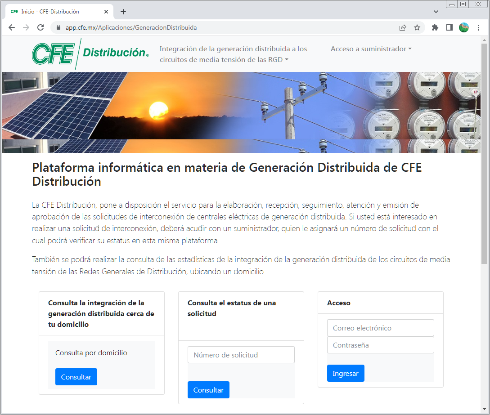

## ABOUT THIS REPOSITORY

This repository archives some of the **python-data-processing-scripts** that were developed during my time as a contractor for INEEL (https://www.gob.mx/ineel) between 2017 and 2019.

The development of these scripts was part of a government project for the **National Commission of Electricity** (CFE) and the **National Center for Energy Control** (CENACE).

> The publisher/author participated in creating the codebase and implementing the web application (using C# and ASP.Net Framework 4.6) for interconnection requests, which is part of CFE's set of applications, as well as in the implementation of Python data processing scripts.

The web application can be accessed at: https://app.cfe.mx/Aplicaciones/GeneracionDistribuida.

This project was managed by INEEL personnel. These scripts are published to provide guidance on the Python programming language and to offer visibility into the author's work.

**This is an ARCHIVED minimal version, and no further commits will be made.**

# Plataforma informática en materia de Generación Distribuida de CFE Distribución | CFE | Mexico

*"La CFE Distribución, pone a disposición el servicio para la elaboración, recepción, seguimiento, atención y emisión de aprobación de las solicitudes de interconexión de centrales eléctricas de generación distribuida. Si usted está interesado en realizar una solicitud de interconexión, deberá acudir con un suministrador, quien le asignará un número de solicitud con el cual podrá verificar su estatus en esta misma plataforma."*

## DIARIO OFICIAL DE LA FEDERACION RESOLUCIÓN Núm. RES/142/2017

https://www.dof.gob.mx/nota_detalle.php?codigo=5474790&fecha=07/03/2017#gsc.tab=0

RESOLUCIÓN DE LA COMISIÓN REGULADORA DE ENERGÍA POR LA QUE EXPIDE LAS DISPOSICIONES ADMINISTRATIVAS DE CARÁCTER GENERAL, LOS MODELOS DE CONTRATO, LA METODOLOGÍA DE CÁLCULO DE CONTRAPRESTACIÓN Y LAS ESPECIFICACIONES TÉCNICAS GENERALES, APLICABLES A LAS CENTRALES ELÉCTRICAS DE GENERACIÓN DISTRIBUIDA Y GENERACIÓN LIMPIA DISTRIBUIDA.

- PRIMERO. Que el Plan Nacional de Desarrollo 2013 - 2018 (PND), publicado en el Diario Oficial de la Federación (DOF) el 20 de mayo de 2013, determina la ejecución de líneas de acción enfocadas en asegurar el abastecimiento racional de energía eléctrica, promover su uso de manera eficiente, y el aprovechamiento de fuentes renovables, mediante la adopción de nuevas tecnologías y la implementación de mejores prácticas.
- SEGUNDO. Que el 30 de mayo de 2016, se dio a conocer el Programa de Desarrollo del Sistema Eléctrico Nacional (PRODESEN) 2016 - 2030, instrumento que contiene el Programa de Ampliación y Modernización de las Redes Generales de Distribución, y que plantea como uno de sus objetivos, extender el Servicio de Distribución a través de la promoción del uso sustentable de las Energías Renovables y el desarrollo de proyectos de Generación Distribuida.
- TERCERO. Que el Programa Nacional para el Aprovechamiento Sustentable de la Energía (PRONASE) 2014 - 2018, proyecta incrementar la eficiencia energética en los sectores residencial, comercial y servicios, agropecuario e industrial, a través de líneas de acción basadas en la sustitución de tecnologías y el uso de esquemas de Generación Distribuida de pequeña y gran escala.
- CUARTO. Que dentro de las estrategias establecidas en el Programa Especial de Cambio Climático 2014 - 2018, se plantea la ejecución de proyectos y acciones de eficiencia energética, así como promover y facilitar acciones de reducción de emisiones del sector privado, mediante el uso de la Generación Distribuida de energía en el sector doméstico, comercial e industrial, en pequeña y gran escala 
- (....)
